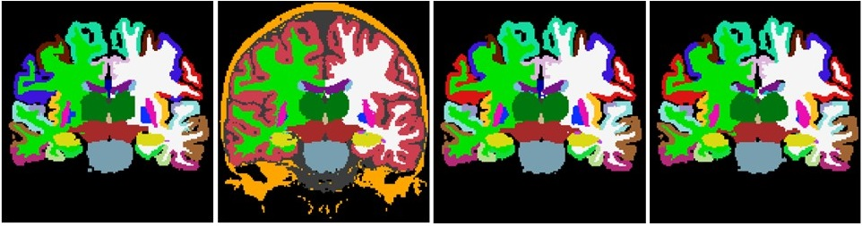
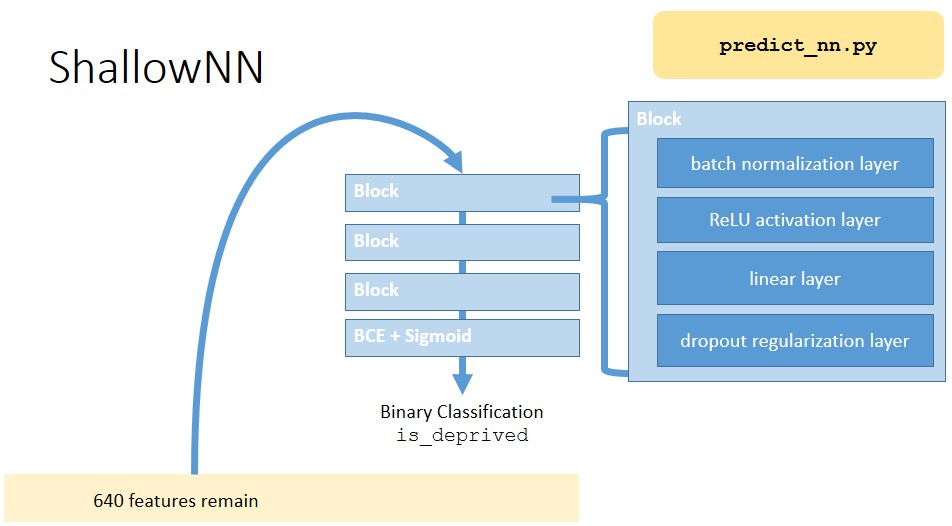

*code, data and documentation behind the publication:*

# Robustness Of Radiomics To Variations In Segmentation Methods In Multimodal Brain MRI

*By Maarten Gijsbert Poirot, Matthan Caan, Henricus Gerardus Ruhe, Atle Bjørnerud, Inge Groote, Liesbeth Reneman and Henk Marquering.*

Preprint available at https://europepmc.org/article/ppr/ppr468812 

## Abstract

**Background**: Radiomics in neuroimaginguses fully automatic segmentation to delineate the anatomical areas for whichradiomic features are computed. However, differences among these segmentationmethods affect radiomic features to an unknown extent.

**Method**: A scan-rescan dataset(n=46) of T1-weighted and diffusion tensor images was used. Subjects were splitinto a sleep-deprivation and a control group. Scans were segmented using foursegmentation methods from which radiomic features were computed. First, wemeasured segmentation agreement using the Dice-coefficient. Second, robustnessand reproducibility of radiomic features were measured using the intraclasscorrelation coefficient (ICC). Last, difference in predictive power wasassessed using the Friedman-test on performance in a radiomics-based sleepdeprivation classification application.

**Results**: Segmentationagreement was generally high (interquartile range=0.77-0.90) and median feature robustness tosegmentation method variation was higher (ICC>0.7) than scan-rescanreproducibility (ICC 0.3-0.8). However, classification performance differed significantlyamong segmentation methods (p<0.001) ranging from 77% to 84%. Accuracy washigher for more recent deep learning-based segmentation methods.

**Conclusion**: Despite high agreementamong segmentation methods, subtle differences significantly affected radiomicfeatures and their predictive power. Consequently, the effect of differences insegmentation methods should be taken into account when designing and evaluatingradiomics-based research methods. 

## This repository

This repository contains three things:

1. In the `/data` directory you will find the data used to train our models to classify sleep deprived subjects from normal sleep-wake-cycle subjects. Howver, due to data limitations of GitHub repositories, the largest portion of data has been omitted and can be accessed upon request. These files have been replaced by `.gitkeep` files the provide those interested in this repository insight into the structuring of data available.
2. In the `/scripts` directory you will find all scripts used in preprocessing T1 and DTI MRI scans, software used for segmentation, standardizing the directory structure, analyzing the resulting se
3. gmentations, calculating radiomic features, concatenating radiomic features into dataframes, feature selection. Since this is a largely chronological process every step has ben numbered and put into their own directory
4. Lastly, you will also find the `README *.pptx` to guide you through the use of code in combination with the data available. We will now quickly glance over each of these steps and the corresponding data.

Here is a nice picture from the documentation slide deck. Please get in touch if you have any questions.

Best,

Maarten Poirot

